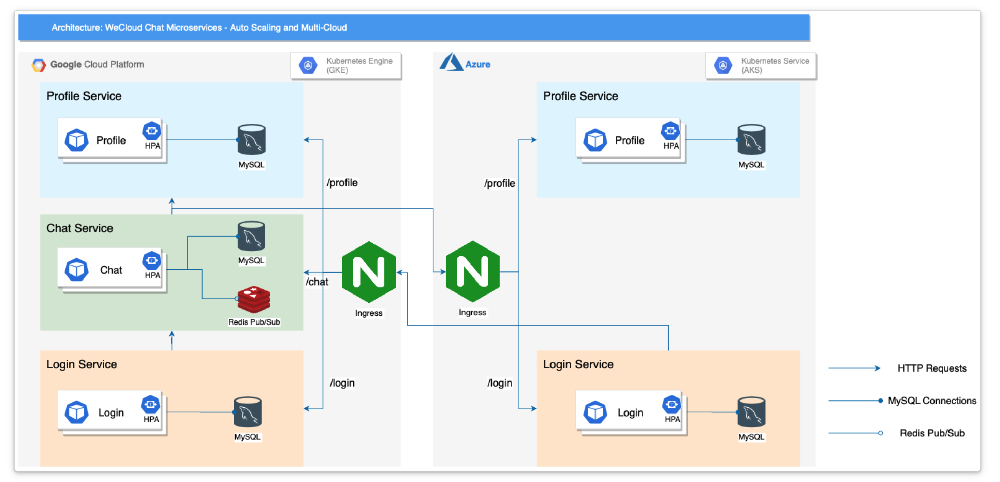

# Project: Containers: Docker and Kubernetes

## 🚀 Project Overview
Designed and implemented a fault-tolerant, highly available microservices architecture for a real-time chat application (WeCloud). The system is deployed across multiple cloud providers (**Google Cloud Platform** and **Microsoft Azure**) using an active-active multi-cloud strategy to eliminate single points of failure and ensure global availability. 

The architecture successfully decomposed a monolithic application into discrete, independently scalable microservices (Login, Profile, and Group Chat) connected via a Directed Acyclic Graph (DAG) topology.

## 🏗️ System Architecture
**

## 📂 Project Structure
This repository is organized into progressive modules, each focusing on specific cloud-native engineering challenges:

1.  **[Containerizing Profile Service](./containerizing-profile-service)**: Base containerization of Spring Boot applications using Docker.
2.  **[GKE Deployment Foundations](./gke-deploy-profile-service)**: Initial orchestration on Google Kubernetes Engine.
3.  **[Helm & MySQL Migration](./helm-mysql-profile-service)**: Transitioning to persistent storage and templated Kubernetes manifests.
4.  **[Microservices Ingress & Redis](./wecloud-microservices-ingress)**: Layer 7 routing and distributed state synchronization with Redis Pub/Sub.
5.  **[Multi-Cloud Auto-scaling](./multi-cloud-autoscaling-k8s)**: Implementing HPA and cross-cloud (GCP/Azure) replication for high availability.
6.  **[Automated CI/CD Pipeline](./microservices-cicd-pipeline)**: End-to-end automation with GitHub Actions and OIDC authentication.
7.  **[Global Traffic Management](./global-traffic-azure-frontdoor)**: Global load balancing and IaC with Azure Front Door and Terraform.

**Key Architecture Highlights:**
* **Global Routing:** Utilized **Azure Front Door** for global traffic routing based on performance and endpoint availability.
* **Multi-Cloud Kubernetes:** Orchestrated containerized services across **GKE (GCP)** and **AKS (Azure)** using **Helm charts** for standardized deployments.
* **Inter-Service Communication:** Implemented RESTful APIs for node-to-node communication and **Redis Pub/Sub** for decoupled, real-time message broadcasting in the Chat service.
* **Auto-Scaling:** Configured Horizontal Pod Autoscalers (HPA) to dynamically scale individual services based on load patterns.

## 🛠️ Tech Stack
* **Cloud Providers:** Google Cloud Platform (GCP), Microsoft Azure
* **Containerization & Orchestration:** Docker, Kubernetes (GKE, AKS), Helm, Artifact Registry (GAR), Azure Container Registry (ACR)
* **Backend Microservices:** Java (Spring Boot, Spring Security, Spring JPA, Spring Cloud Ribbon)
* **Messaging & Database:** Redis Pub/Sub, MySQL
* **Infrastructure as Code (IaC) & CI/CD:** Terraform, GitHub Actions

## ⚙️ Key Engineering Achievements

### 1. Monolith to Microservices Migration
Successfully containerized legacy Java Spring applications into optimized Docker images. Established a robust networking topology where services communicate securely. Designed the Group Chat service to asynchronously query the Profile service without creating performance bottlenecks.

### 2. Multi-Cloud Fault Tolerance & Disaster Recovery
Configured a multi-cloud deployment mimicking enterprise-grade disaster recovery. If the GKE cluster experiences downstream failures, traffic is automatically routed away, and the AKS cluster scales up via HPA to absorb the redistributed load, ensuring zero downtime.

### 3. Automated CI/CD Pipelines
Adopted DevOps best practices by building a fully automated deployment pipeline using **GitHub Actions**. The workflow handles code linting, building Docker images, pushing to GAR/ACR, and seamlessly updating Helm charts across both Kubernetes clusters upon every code commit.

## 📊 Performance & Optimization
* **Cost Optimization:** Optimized cloud resource allocation via **Terraform**, effectively utilizing `e2-medium` and `n1-standard-1` instances to maintain a balance between high availability and infrastructure efficiency.
* **Real-time Synchronization:** Resolved complex synchronization challenges in the Chat service by properly configuring STOMP over WebSocket integrated with Redis Pub/Sub for low-latency message delivery.
* **Resilience Testing:** Validated fault tolerance by simulating regional outages, confirming that traffic automatically failovers to secondary clusters with minimal performance degradation.